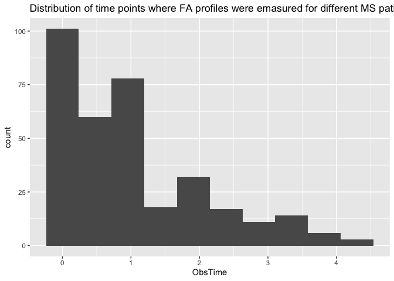
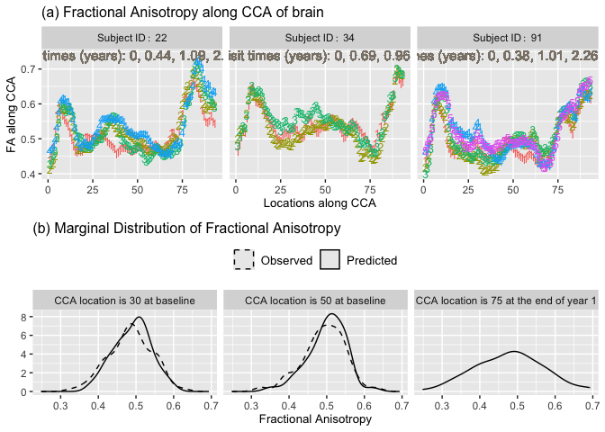

# sLFDA Vignette

# Introduction

This R package is built for analyzing longitudinal functional data
analysis accounting the skewness in marginal distribution. The
methodology based on that it was built is available in Alam and Staicu
(20xx). Note that the package is still in developing stage.

# Installation

To install the package, run the following codes

``` r
devtools::install_github("https://github.com/msalam14/sLFDA")
```

# DTI data analysis

This document demonstrate the analysis of diffusion tensor imaging (DTI)
study data; particularly, the codes used and the results obtained.
However, due to confidentiality, the data set is not shared in this
demonstration. Instead, we use the partial data available in the
*refund* package (Greven et al. 2010). Due to unavailability, we discuss
everything here without the baseline age data.

- First call the required packages

``` r
library(sLFDA)
library(refund)
library(fda)
library(mgcv)
library(sn)
library(tidyverse)
library(dplyr)
library(ggpubr)
library(ggplot2)
library(gridExtra)
library(plotly)
```

- Data pre-processing

``` r
data(DTI,package="refund") # loading DTI data
DTI<-DTI %>%
  filter(case==1) # selection of MS patients only
ss_cca<-1:93/93 # conversion of tract locations to be in [0,1]
dti_OT<-DTI$visit.time/max(DTI$visit.time) # conversion of visit time to be in [0,1]
dtiYR<-round(DTI$visit.time/365,2) # visit time in year
```

- There are few FA profiles for which, we do not have FA values for all
  $93$ locations. We fit a spline smoothing for those FA profiles to
  impute the missing values.

``` r
misINFO<-which(is.na(DTI$cca),arr.ind = TRUE)
misFA<-split(misINFO[,2],misINFO[,1])
misFP<-as.numeric(names(misFA))
misTRCT<-lapply(misFA,as.numeric)
yDTI<-DTI$cca
for(i in seq_len(length(misTRCT))){
  y<-yDTI[misFP[i],-misTRCT[[i]]]
  x<-ss_cca[-misTRCT[[i]]]
  x_new<-ss_cca[misTRCT[[i]]]
  y_new<-spline(x=x,y=y,xout=x_new,method = "natural")$y
  DTI$cca[misFP[i],misTRCT[[i]]]<-y_new
}
```

- Original DTI data has patients’ ID starting from $1001$. We convert
  them to $1,2,\ldots$

``` r
# Construction of patient ID starting from 1
dti_ID<-NULL
dti_ID[1]<-1
for(i in 2:nrow(DTI)){
  a<-ifelse((DTI$ID[i]-DTI$ID[(i-1)])!=0,dti_ID[(i-1)]+1,dti_ID[(i-1)])
  dti_ID[i]<-a
}
```

- Creating a meta data frame for MS patients

``` r
ms_meta<-data.frame("ID"=dti_ID,
                    "ObsTime"=dtiYR)
```

- The distribution of observed time points

``` r
ms_meta %>%
  ggplot(aes(ObsTime)) +
  geom_histogram(bins = 10) +
  ggtitle("Distribution of time points where FA profiles were emasured for different MS patients.")
```



- Grid selection in the time domain

``` r
ntp<-20 # choice of B
tp<-round(matrix(seq(0,1,length.out = ntp),ncol=1),2) # equally spaced grid of length B
Tg<-seq(0,max(DTI$visit.time),5)/max(DTI$visit.time) # grid where population level functions will be estimated
```

- Data preparation to fit *sLFDA* model

``` r
Y<-split.data.frame(x = DTI$cca,f = dti_ID) # splitting the data for every subject
Tij<-split(x=dti_OT,f=dti_ID) # splitting the time for every subject
```

- Model fitting ($sLFDA_1$)

``` r
slfda1<-skewedFDA(funDATA=Y,funARG=ss_cca,obsTIME=Tij,ETGrid=tp,DOP=1,KernelF=depan,CV=TRUE,Hgrid=seq(0.04,0.5,0.02),CVThresh = 0.05,PenaltyF=Qpenalty,plfGT=Tg,
                  ES2knots=c(10,10),ES2bs=c("ps","ps"),ES2m=c(2,2),ES2Esp="REML",
                  LPknots=c(10,10),LPbs=c("ps","ps"),LPm=c(2,2),
                  Cov2nbasis=c(10,10),PVE=c(0.95,0.90),
                  Prediction=TRUE,PSid=unique(dti_ID),PredGS=NULL,PredGT=Tij)
```

- Saving the fitted $sLFDA_1$ object for several post analysis

``` r
save(slfda1,file="DTI_RESULTS/slfda1.RData")
```

- Loading the fitted $sLFDA_1$ object

``` r
load(file="DTI_RESULTS/slfda1.RData")
```

- Figure 1 used in the manuscript

``` r
pID<-c(22,34,91)
g1<-as.data.frame(DTI$cca) %>%
  mutate(ID=ms_meta$ID,
         Time=ms_meta$ObsTime) %>%
  group_by(ID) %>%
  mutate(Visit=as.factor(row_number())) %>%
  ungroup() %>%
  pivot_longer(cols = starts_with("cca_"),names_to = "CCA",values_to = "FA",names_prefix = "cca_") %>%
  mutate(CCA=as.numeric(CCA)) %>%
  filter(ID%in%pID) %>%
  mutate(textP=45,
         SubText=ifelse(ID==pID[1],paste("Visit times (years): ",paste(round(ms_meta$ObsTime[ms_meta$ID==pID[1]],2),sep="",collapse=", "),".",sep =""),
                        ifelse(ID==pID[2],paste("Visit times (years): ",paste(round(ms_meta$ObsTime[ms_meta$ID==pID[2]],2),sep="",collapse=", "),".",sep =""),paste("Visit times (years): ",paste(round(ms_meta$ObsTime[ms_meta$ID==pID[3]],2),sep="",collapse=", "),".",sep ="")))) %>%
  mutate(ID=factor(recode(ID,
                          "22"="paste(Subject~ID:~22)",
                          "34"="paste(Subject~ID:~34)",
                          "91"="paste(Subject~ID:~91)"),
                   levels=c("paste(Subject~ID:~22)",
                            "paste(Subject~ID:~34)",
                            "paste(Subject~ID:~91)"))) %>%
  ggplot(aes(x=CCA,y=FA,group=Visit,color=Visit))+
  geom_point(aes(shape=Visit),size=3)+
  facet_wrap(~ID,labeller = label_parsed)+
  theme(legend.position = "",legend.text = element_text(size=10),legend.title = element_text(size=10),title = element_text(size=10))+
  ylab("FA along CCA")+
  xlab("Locations along CCA") +
  scale_shape_identity() +
  geom_text(aes(x=textP,y=0.74,label=SubText),col="antiquewhite4",size=4) +
  ggtitle("(a) Fractional Anisotropy along CCA of brain")

slfda_prd<-predict_slfda(fitOBJ=slfda1,PSid=unique(ms_meta$ID),PredGS=NULL,PredGT=split(rep(1,length(unique(ms_meta$ID))),unique(ms_meta$ID)),outSAMPLE=FALSE, CovDep=FALSE,DesignMat=NULL,PredDesignMat = NULL)

cbbPalette <- c("#000000", "#E69F00", "#56B4E9", "#009E73", "#F0E442", "#0072B2", "#D55E00", "#CC79A7")
clr<-cbbPalette[c(2,6)]

cc60est<-as.numeric(slfda1$EstParam %>% filter(Space==ss_cca[60] & Time==0))

cpar<-c(cc60est[1]+(cc60est[2]*45.07),exp(cc60est[3]),as.numeric(dp2cp(c(0,1,cc60est[4]),family="SN")[3]))

cca_loc<-c(30,50,75)

prd_base<-data.frame("ID"=rep(unique(ms_meta$ID),each=3),
                     "Time"=0,
                     "Visit"=as.factor(1),
                     "CCA"=factor(rep(c(paste("CCA location is",cca_loc[1],"at baseline"),
                             paste("CCA location is",cca_loc[2],"at baseline"),
                             paste("CCA location is",cca_loc[3],"at the end of year 1")),times=length(unique(ms_meta$ID))),levels=c(paste("CCA location is",cca_loc[1],"at baseline"),
                             paste("CCA location is",cca_loc[2],"at baseline"),
                             paste("CCA location is",cca_loc[3],"at the end of year 1"))),
                     "FA"=as.numeric(sapply(unique(ms_meta$ID),function(u){c(slfda1$PredFD[[u]][1,cca_loc[1:2]],slfda_prd[[u]][1,cca_loc[3]])})),
                     "Type"="Predicted")

g2<-as.data.frame(DTI$cca) %>%
  mutate(ID=c(ms_meta$ID),
         Time=c(ms_meta$ObsTime)) %>%
  group_by(ID) %>%
  mutate(Visit=as.factor(row_number())) %>%
  ungroup() %>% 
  pivot_longer(cols = starts_with("cca_"),names_to = "CCA",values_to = "FA",names_prefix = "cca_") %>%
  mutate(CCA=as.numeric(CCA)) %>%
  filter(CCA%in%c(cca_loc[1:2]) & Time==0) %>%
  mutate(CCA=factor(ifelse(CCA==cca_loc[1],paste("CCA location is",cca_loc[1],"at baseline"),
                           ifelse(CCA==cca_loc[2],paste("CCA location is",cca_loc[2],"at baseline"),paste("CCA location is",cca_loc[3],"at the end of year 1"))),
                    levels=c(paste("CCA location is",cca_loc[1],"at baseline"),
                             paste("CCA location is",cca_loc[2],"at baseline"),
                             paste("CCA location is",cca_loc[3],"at the end of year 1"))),
         Type="Observed") %>%
  add_case(prd_base) %>%
  ggplot(aes(FA,group=Type)) +
  geom_density(aes(linetype=Type)) +
  facet_wrap(~CCA) +
  xlab("Fractional Anisotropy") +
  ylab("")+
  theme(legend.position = "top",legend.text = element_text(size=10),legend.title = element_blank(),title = element_text(size=10)) +
  scale_color_manual(labels=c("Observed","Predicted"),values=clr)+
  ggtitle("(b) Marginal Distribution of Fractional Anisotropy") +
  scale_linetype_manual(c("Observed,Predicted"),values=c("dashed","solid"))
grid.arrange(g1,g2,nrow=2)
```



- Next, we present the estimated mean and standard deviation functions

``` r
pop_mean<-do.call(cbind,split(slfda1$EstParam$X1,slfda1$EstParam$Space))
colnames(pop_mean)<-ss_cca*93
rownames(pop_mean)<-round(Tg*max(ms_meta$ObsTime),2)
m3d<-plotly::plot_ly(y=round(Tg*max(ms_meta$ObsTime),2),x=ss_cca*93,z=pop_mean,type="surface",showscale=FALSE) %>%
  plotly::layout(title=list(text="(a) Mean function",
                            x=0.3,
                            y=0.9),
                 scene = list(
      xaxis = list(title = "CCA", showgrid = T,showline = TRUE, mirror = TRUE, linecolor = 'black',autorange="reversed"),
      yaxis = list(title = "Visit time", showgrid = T,showline = TRUE, mirror = TRUE, linecolor = 'black',autorange="reversed"),
      zaxis = list(title = "", showgrid = T,showline = TRUE, mirror = TRUE, linecolor = 'black',nticks=8,range=c(0.30,0.70)),
      legend = list(orientation = "v",   # show entries horizontally
                    xanchor = "right",  # use center of legend as anchor
                    x = 0.5)
      
    )) 
```

``` r
pop_scale<-do.call(cbind,split(exp(slfda1$EstParam$X3),slfda1$EstParam$Space))
colnames(pop_scale)<-ss_cca*93
rownames(pop_scale)<-round(Tg*max(ms_meta$ObsTime),2)
s3d<-plotly::plot_ly(y=round(Tg*max(ms_meta$ObsTime),2),x=ss_cca*93,z=pop_scale,type="surface",showscale=F) %>%
  plotly::layout(title=list(text="(c) Standard deviation function",x=0.3,y=0.8),
    scene = list(
      xaxis = list(title = "CCA", showgrid = T,showline = TRUE, mirror = TRUE, linecolor = 'black',autorange="reversed"),
      yaxis = list(title = "Visit time", showgrid = T,showline = TRUE, mirror = TRUE, linecolor = 'black',autorange="reversed"),
      zaxis = list(title = "", showgrid = T,showline = TRUE, mirror = TRUE, linecolor = 'black',nticks=8),
      legend = list(orientation = "v",   # show entries horizontally
                    xanchor = "right",  # use center of legend as anchor
                    x = 0.5)
      
    )) 
```

``` r
m3d<-plotly::plot_ly(y=round(Tg*max(ms_meta$ObsTime),2),x=ss_cca*93,z=pop_mean, scene='scene') %>% add_surface(showscale=FALSE)

s3d<-plotly::plot_ly(y=round(Tg*max(ms_meta$ObsTime),2),x=ss_cca*93,z=pop_scale,scene='scene4') %>% add_surface(showscale=FALSE)
```

``` r
f1 <- list(
  family = "Arial, sans-serif",
  size = 16,
  color = "black")
f2 <- list(
  family = "Arial, sans-serif",
  size = 12,
  color = "black")

f3 <- list(
  family = "Arial, sans-serif",
  size = 12,
  color = "black")

subplot(m3d,s3d) %>%
  layout(scene=list(domain=list(x=c(0,0.5),y=c(0,1)),
      xaxis = list(title = "CCA", showgrid = T,showline = TRUE, mirror = TRUE, linecolor = 'black',autorange="reversed",font=f2),
      yaxis = list(title = "Visit time", showgrid = T,showline = TRUE, mirror = TRUE, linecolor = 'black',autorange="reversed",font=f2),
      zaxis = list(title = "", showgrid = T,showline = TRUE, mirror = TRUE, linecolor = 'black',nticks=10)),
    scene4=list(domain=list(x=c(0.5,1),y=c(0,1)),
      xaxis = list(title = "CCA", showgrid = T,showline = TRUE, mirror = TRUE, linecolor = 'black',autorange="reversed",font=f2),
      yaxis = list(title = "Visit time", showgrid = T,showline = TRUE, mirror = TRUE, linecolor = 'black',autorange="reversed",font=f2),
      zaxis = list(title = "", showgrid = T,showline = TRUE, mirror = TRUE, linecolor = 'black',nticks=8)),
    annotations=list(list(x=0.2,
                          y=0.9,
                          text="(a) Mean function",
                          font=f1),
                     list(x=0.7,
                          y=0.9,
                          text="(b) Standard deviation function",
                          font=f1)))
```

    Warning: 'layout' objects don't have these attributes: 'NA'
    Valid attributes include:
    '_deprecated', 'activeshape', 'annotations', 'autosize', 'autotypenumbers', 'calendar', 'clickmode', 'coloraxis', 'colorscale', 'colorway', 'computed', 'datarevision', 'dragmode', 'editrevision', 'editType', 'font', 'geo', 'grid', 'height', 'hidesources', 'hoverdistance', 'hoverlabel', 'hovermode', 'images', 'legend', 'mapbox', 'margin', 'meta', 'metasrc', 'modebar', 'newshape', 'paper_bgcolor', 'plot_bgcolor', 'polar', 'scene', 'selectdirection', 'selectionrevision', 'separators', 'shapes', 'showlegend', 'sliders', 'smith', 'spikedistance', 'template', 'ternary', 'title', 'transition', 'uirevision', 'uniformtext', 'updatemenus', 'width', 'xaxis', 'yaxis', 'barmode', 'bargap', 'mapType'


<div id="refs" class="references csl-bib-body hanging-indent">

<div id="ref-greven2010longitudinal" class="csl-entry">

Greven, Sonja, Ciprian Crainiceanu, Brian Caffo, and Daniel Reich. 2010.
“Longitudinal Functional Principal Component Analysis.” *Electronic
Journal of Statistics* 4: 1022–54.

</div>

</div>
